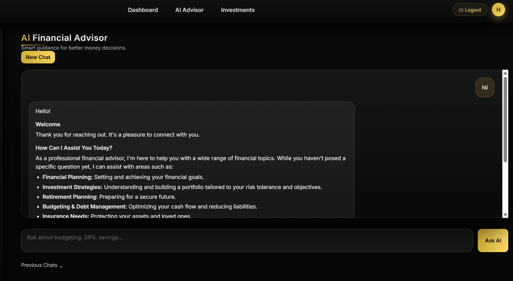
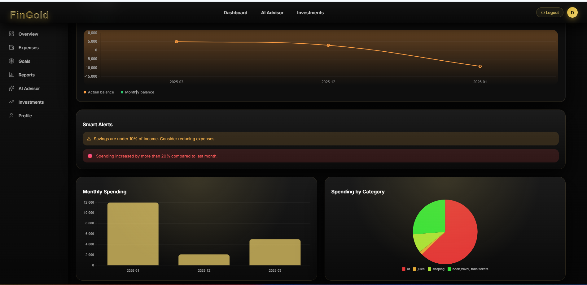

## 🧭 System Flow

User → Dashboard → Backend APIs → AI Engine → Insights → User

# 💰 DhanEase – AI-Based Financial Advisor

**DhanEase** is an **AI-powered personal finance management platform** that helps users  
**track expenses, manage savings, plan financial goals, and receive intelligent guidance**  
— all through a **clean, modern dashboard**.

> 🎯 Built to make financial decision-making **simple, data-driven, and accessible**,  
> especially for **students and young professionals**.

---

## ✨ Key Highlights

- 📊 Understand your financial health in **under 3 seconds**
- 🤖 AI-powered financial advice (budgeting & spending)
- 🎯 Goal-based financial planning with progress tracking
- 📈 Visual analytics for expenses and savings
- 🔐 Secure, user-specific data handling

---

## 🚀 Features

### 📊 Smart Financial Dashboard
- Centralized view of **income, expenses, savings, and overall financial health**
- Clean, card-based UI for instant insights

---

### 🤖 AI Financial Advisor
- AI chatbot provides **personalized budgeting, saving, and spending suggestions**
- Helps users make better decisions **without human intervention**

---

### 🎯 Goal-Based Financial Planning
- Create **short-term and long-term financial goals**
- Track progress with **real-time updates and visual indicators**

---

### 📈 Expense & Spending Analytics
- Analyze spending patterns across categories
- Identify overspending and saving opportunities

---

### 🔐 Secure User Management
- Authentication and authorization
- User-specific data storage and protected access

---

### 📱 Responsive & Modern UI
- Optimized for desktop and tablet
- Premium dark-themed fintech dashboard

---

## 🛠️ Tech Stack

### Frontend
- React.js  
- JavaScript (ES6+)  
- HTML5, CSS3  
- Chart libraries for data visualization  

### Backend
- Node.js  
- Express.js  
- REST APIs  

### Database
- MongoDB  

### AI Integration
- OpenAI / Gemini API  

### Tools
- Git & GitHub  
- VS Code  
- Postman  

---

## 📸 Screenshots

### landing page


### AI Financial Advisor


### Home page


### Overview



## 🧠 How DhanEase Works

1. User signs up and logs in securely  
2. Income, expenses, and goals are added  
3. Data is stored and processed in the backend  
4. Dashboard visualizes financial health  
5. AI analyzes data and provides recommendations  
6. User improves financial habits using insights  

---

## ⚙️ Installation & Setup

```bash
# Clone the repository
git clone https://github.com/deveshsharma27/dhanease.git

# Navigate to project directory
cd dhanease

# Install dependencies
npm install

# Start development server
npm run dev
